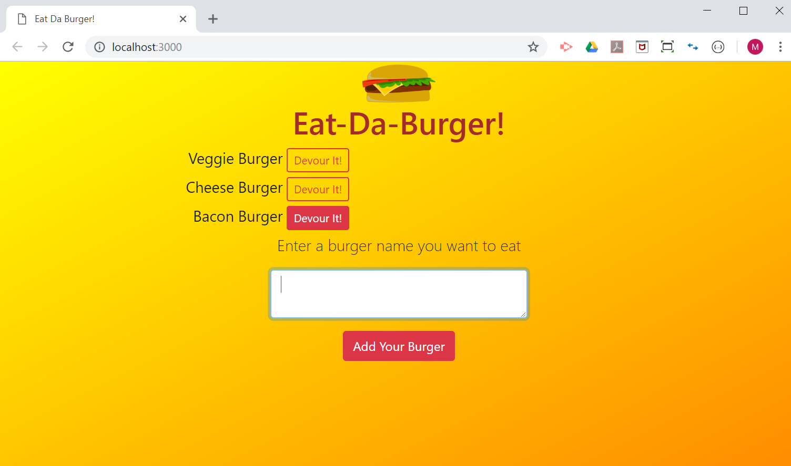
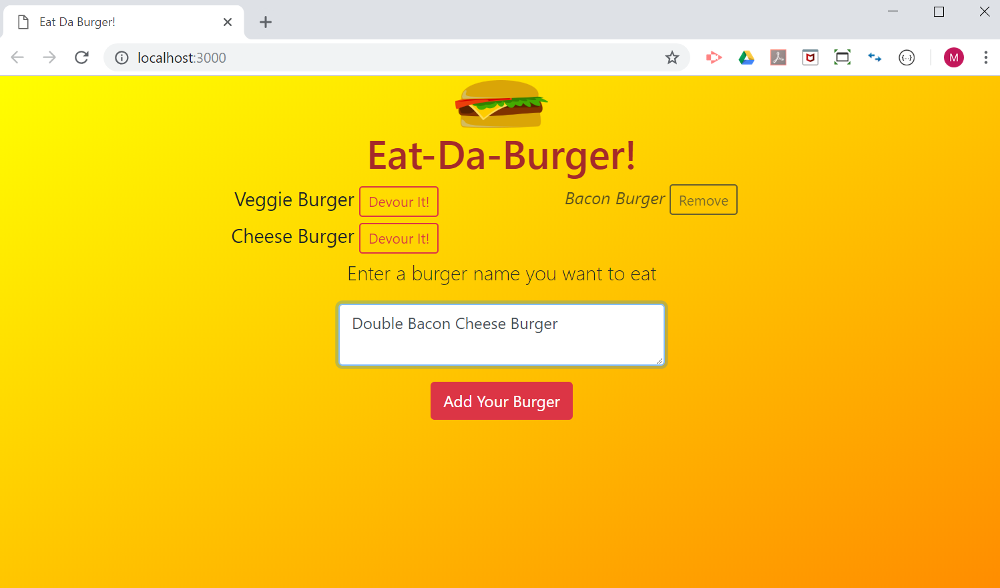
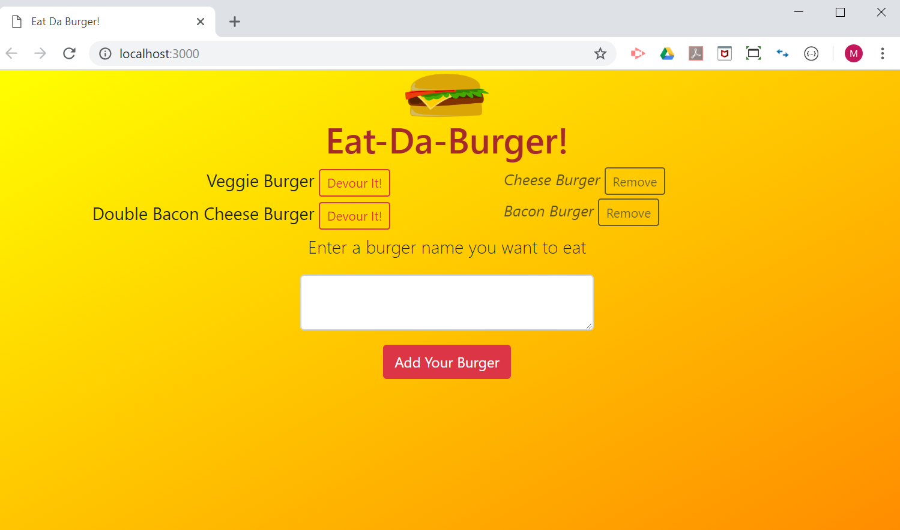
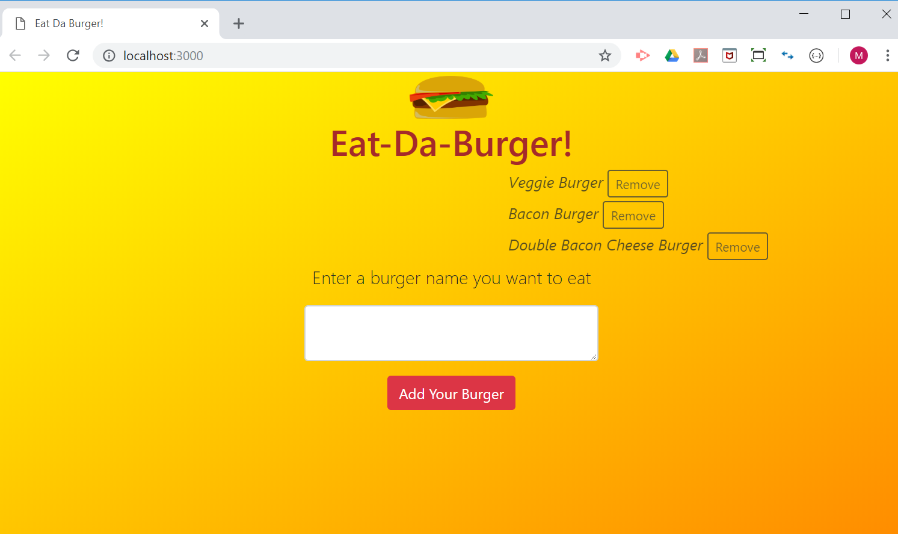

# Eat-Da-Burger! -- Node Express Handlebars

## Overview

* Eat-Da-Burger! is a restaurant app that lets users input the names of burgers they'd like to eat. Whenever a user submits a burger's name, your app will display the burger on the left side of the page -- waiting to be devoured.

* Each burger in the waiting area also has a `Devour it!` button. When the user clicks it, the burger will move to the right side of the page.

* Each `devoured` burger on the right side also has a `Remove` button to be deleted from the list and the internal database in the backend.

### Deployment and Availability

* Heroku
  * Live app - https://aqueous-beach-82382.herokuapp.com
  *     _likely in a crashed state and unavailable_ -- see [the details](README-heroku.md)
* GitHub
  * Repository - https://github.com/mmakino/burger

### Intallation

* This full stack app can also be installed __locally__ through the following steps 

1. Clone the git repository
    ```
    git clone https://github.com/mmakino/burger.git
    ```
1. Install necessary packages
    ```
    npm install
    ```
    * This app uses the following NPM packages:
    ```
      "dotenv": "^6.2.0",
      "express": "^4.16.4",
      "express-handlebars": "^3.0.0",
      "mysql": "^2.16.0"
    ```
1. Create a `.env` file under the top burger app directory for MySQL connection. Enter the user and password in the file. The format is simple as below:
    ```
    # Local MySQL user and password
    MYSQL_USER=<user_name>
    MYSQL_PASSWD=<password>
    
    # Heroku ClearDB Connection URL [OPTIONAL, NOT NEEDED For local server]
    CLEARDB_DATABASE_URL=mysql://asdfasdfasdf@us-asdf-iron-south-03.cleardb.net/heroku_12344567?reconnect=true
    ```
1. MySQL database setup
    * `db` subdirectory contains two SQL query files.
    ```
      db
      ├── schema.sql
      └── seed.sql
    ```
    * The `schema.sql` needs to be run/sourced to set up the database and table for this app.
        * Database: burgers_db
        * Table: burgers
    * The `seed.sql` may be used to populate with small mock data(burgers!).
1. Start the web server
    ```
    node server.js
    ```
    * It should display the following message when the server has started successfully
      ```
      Server started listening on port 3000
      Connected to database as ID: 771
      ```
1. Open the web page in a browser by entering the following URL into the address bar.
    ```
    http://localhost:3000/
    ```

### Demo
* Although this is one page small app, hope the following snapshots give some ideas

* Clicking on `Devour It!` button will move the burger to the right side.
    
* Enter a burger name in the text box and press `Add Your Burger` to add the burger to be devoured. 
    
    
* All the burgers have been devoured. They can now be removed by clicking on the `Remove` buttons.
    
    
### Directories & Files
```
burger
├── README.md                 -- this file
├── config
│   ├── connection.js         -- MySQL connection setup file
│   └── orm.js                -- Object Relational Mapper javascript
├── controllers
│   └── burgers_controller.js -- Implements routes for end-points
├── db
│   ├── schema.sql            -- MySQL database and table schema
│   └── seed.sql              -- Mock data (3 burgers)
├── homework_instructions.md  -- THe original instructions/requirements
├── models
│   └── burger.js             -- Interface btw the ORM and the controller
├── package.json              -- NPM JSON package file
├── public
│   └── assets
│       ├── css
│       │   └── style.css     -- Style sheet for the main page
│       ├── image
│       │   └── burger.png    -- Burger clip-art image
│       └── javascript
│           └── app.js        -- jQuery AJAX calling to routes
├── server.js                 -- The main server javascript file
└── views
    ├── images
    ├── index.handlebars      -- HTML body handlebars file
    └── layouts
        └── main.handlebars   -- Main HTML handlebars file

12 directories, 15 files
```

#### Written by [Motohiko Makino](https://mmakino.github.io/)

